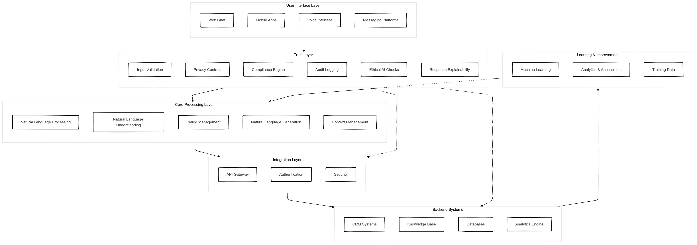

With the implementation of Conversational AI, it is crucial to get the architecture right from the start. Today, I want to share my insights on the key components that make up a robust conversational AI system, with a special focus on what I consider the most critical yet often overlooked layer: trust.

The user interface layer might seem straightforward, but I've seen projects fail because teams underestimated its complexity. It's not just about having a chat window – it's about creating seamless experiences across:

- Web chat interfaces that feel natural and responsive
- Voice interfaces that handle the nuances of speech

### The Trust Layer: Our Security Guardian

The trust layer is your system's immune system, and it consists of:

#### Input Validation
I remember one project where we caught a sophisticated prompt injection attack thanks to our robust input validation. It's not just about filtering out malicious inputs – it's about understanding the context of every interaction.

#### Privacy Controls
With GDPR and CCPA in play, this isn't optional anymore. Every system should have PII detection and data anonymization baked in, something you don't want to retrofit this later.

#### Compliance Engine
Having worked with healthcare and financial services clients, I can't stress enough how critical this component is. Your compliance engine needs to be both rigid enough to enforce rules and flexible enough to adapt to changing regulations.

### The Processing Core: Where the Magic Happens

The core processing layer is what transforms user inputs into meaningful interactions. It includes:

- Natural Language Processing (NLP) for basic text analysis
- Natural Language Understanding (NLU) for intent recognition
- Dialog Management for conversation flow
- Natural Language Generation (NLG) for response creation
- Context Management for maintaining conversation state

### The Integration Layer: Bridging the Gap

One critical component is the importance of your integration layer. It's not just about connecting systems; it's about doing so securely and efficiently. This layer handles:

- API Gateway management
- Authentication services
- Security protocols

### The Backend: Your System's Brain

The backend is where all your business logic lives. In my experience, a well-designed backend should include:

- CRM system integration (I've worked extensively with Salesforce and Dynamics)
- Knowledge base management
- Database operations
- Analytics engines

### The Learning Layer: Continuous Improvement

The final piece of the puzzle is the learning and improvement layer. This is what separates good systems from great ones. It encompasses:

- Machine learning models for continuous improvement
- Analytics and assessment tools
- Training data management

## How It All Works Together

Let me walk you through a typical interaction flow:

1. A customer sends a message through your web chat
2. The trust layer validates the input and checks for compliance issues
3. The processing layer understands the intent and generates a response
4. The integration layer securely connects to your backend systems
5. The backend retrieves the necessary information
6. The learning layer captures the interaction for future improvements

## Real-World Impact

I recently worked with a financial services client where implementing this architecture reduced their customer service costs by 35% while improving satisfaction scores. The key was getting the trust layer right – it gave their compliance team the confidence to allow more complex transactions through the AI system.

## Conclusion

Building a conversational AI system is complex, but getting the architecture right from the start pays dividends. In my experience, the most successful implementations are those that prioritize security and trust while maintaining flexibility for future growth.

Remember: you're not just building a rule based chatbot; you're creating a system that will handle thousands or millions of sensitive customer interactions. Take the time to get it right.
